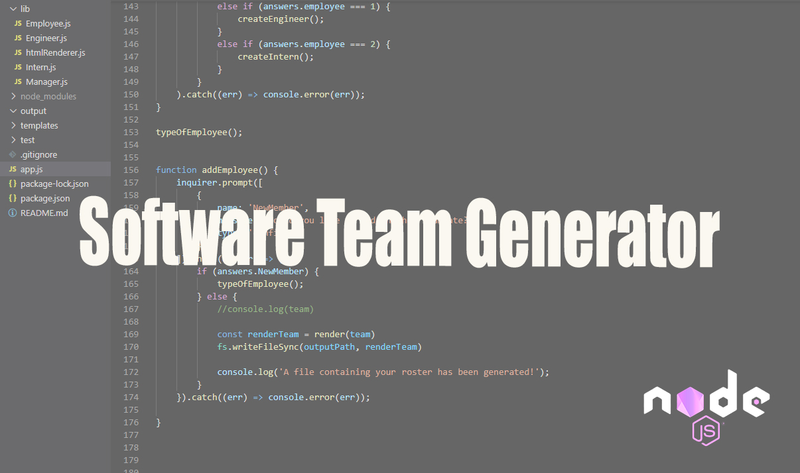

# software-team-generator
A CLI application built with Node.js that generates an employee roster based on user input. Add managers, engineers, and interns to your teams roster.
  
  
  
  
  ## Table of Contents
  1. [Installation](#Installation)
  2. [Usage](#Usage)
  3. [Video](#Video)
  4. [License](#License)
  5. [Contributing](#Contributing)
  6. [Questions](#Questions)
  
  ## Installation 
  Clone this repository by clicking on the green button that says 'Code'
  
  Remeber to run the command 
  
  > npm i
  
  Or
  
  > npm install
  
  to install dependencies before running the application your command line.
  
  ## Usage
  Invoke the applicaton with the command 
  
  > node app.js 
  
  Answer the prompts that appear in the command line. You will be asked to add a manager, engineer, and/or intern. From there, you may enter each employee's email, Id, and role within the team. After completing these steps, this message will appear in the terminal: "A file containing your roster has been generated!"
  If there is an error in generating this file, an error message will appear in the terminal. 
  
  An HTML file will then be generated based on user input and should appear in the 'output' folder. Open the HTML file in a browswer to view your teams generated roster. 
  
  ## Video
  
  Watch the demo video
  
  [TEAM GENERATOR](https:// "SOFTWARE TEAM")

  

  
  
  ## License
  This project operates under the MIT license
  
  
  
  ## Contributing 
  Contributions are welcome
  
  ## Questions
  
  GITHUB: https://github.com/angeleefshaw
  EMAIL: angeleefshaw@gmail.com
  LINKEDIN: https://www.linkedin.com/in/angelee-shaw-2a65861bb/
  
